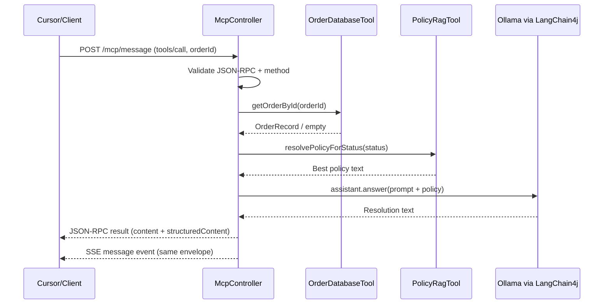
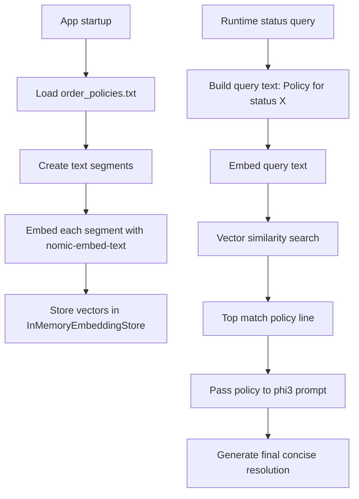
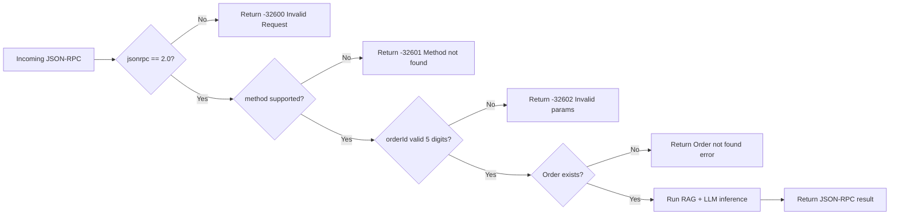

# Complete Code Walkthrough (Easy to Read)

This document explains:
- every class in the project
- every important method and what it does
- every library used and why it is used

Goal: You should be able to read this once and understand the full application flow.

---

## 1) What this application is

This is a **local MCP server** for e-commerce order resolution.

It accepts MCP/JSON-RPC requests, checks order data from H2, finds matching policy by embeddings, asks local Ollama for a concise resolution, and returns structured result.

Main runtime ports/endpoints (current config):
- Server port: `8085`
- Swagger: `http://localhost:8085/swagger-ui.html`
- MCP SSE: `GET /mcp/sse` (also legacy `POST /mcp/sse`)
- MCP message: `POST /mcp/message`

---

## 2) High-level request flow

1. Client connects to `/mcp/sse`.
2. Client sends MCP message to `/mcp/message`.
3. Controller validates JSON-RPC shape.
4. Tool `resolve_order` is executed.
5. Order is fetched from H2.
6. Policy is fetched from in-memory embedding store.
7. Local Ollama model generates final resolution.
8. JSON-RPC result is returned and pushed to SSE stream.

---

## 3) Project classes and detailed explanation

## `EcommerceMcpGatewayApplication`
Path: `src/main/java/com/example/ecommercemcp/EcommerceMcpGatewayApplication.java`

### Purpose
Bootstraps the Spring Boot application.

### Methods
- `main(String[] args)`
  - Entry point for JVM.
  - Calls `SpringApplication.run(...)`.
  - Starts Spring container + auto-configured beans.

---

## `AiConfig`
Path: `src/main/java/com/example/ecommercemcp/AiConfig.java`

### Purpose
Creates and wires all AI-related beans:
- chat model
- embedding model
- LLM concurrency lock
- typed AI assistant interface

### Methods
- `llmSemaphore()`
  - Returns `Semaphore(1, true)`.
  - Allows only one LLM inference at a time.
  - Protects system under constrained hardware.

- `ollamaChatModel()`
  - Creates LangChain4j `OllamaChatModel`.
  - Uses:
    - base URL: `http://localhost:11434`
    - model: `phi3`
    - timeout: 30s
    - temperature: 0.0
  - This model is used for final resolution text generation.

- `ollamaEmbeddingModel()`
  - Creates LangChain4j `OllamaEmbeddingModel`.
  - Uses model `nomic-embed-text`.
  - Used by policy RAG (`PolicyRagTool`).

- `orderResolutionAssistant(ChatLanguageModel model)`
  - Builds AI service interface through `AiServices.builder(...)`.
  - Returns implementation of `OrderResolutionAssistant`.

### Nested interface
- `OrderResolutionAssistant`
  - Method: `answer(String prompt)`
  - Annotated with `@SystemMessage(fromResource = "prompts/order-resolution-system.st")`
  - This means the system prompt is loaded from `.st` resource file, not hardcoded in Java.

---

## `OrderDatabaseTool`
Path: `src/main/java/com/example/ecommercemcp/OrderDatabaseTool.java`

### Purpose
Handles order data in H2 database.

### Fields
- `ORDER_ID_REGEX`
  - Regex pattern: `^[0-9]{5}$`
  - Runtime validation guard.

- `JdbcTemplate jdbcTemplate`
  - Spring JDBC utility to run SQL safely with placeholders.

### Methods
- `initializeAndSeed()` (`@PostConstruct`)
  - Runs automatically at startup.
  - Creates `orders` table if missing.
  - Seeds default orders using H2 `MERGE ... KEY(order_id)` (upsert).
  - Important: non-destructive. Existing manual records are not wiped by `DELETE`.

- `getOrderById(String orderId)`
  - Validates orderId format both by annotation and explicit runtime regex check.
  - Uses parameterized query (`WHERE order_id = ?`) to prevent SQL injection.
  - Returns `Optional<OrderRecord>`.

- `mapOrder(ResultSet rs, int rowNum)`
  - Converts SQL row to `OrderRecord`.

### Record
- `OrderRecord`
  - Immutable data carrier:
    - `orderId`
    - `customerName`
    - `status`
    - `total`
    - `updatedAt`

---

## `PolicyRagTool`
Path: `src/main/java/com/example/ecommercemcp/PolicyRagTool.java`

### Purpose
Loads policy text lines, embeds them, stores them in-memory, and resolves closest policy by status query.

### Fields
- `EmbeddingModel embeddingModel`
  - LangChain4j model used to convert text to vectors.

- `EmbeddingStore<TextSegment> embeddingStore`
  - In-memory vector store.

### Methods
- `initStore()` (`@PostConstruct`)
  - Creates `InMemoryEmbeddingStore`.
  - Loads policy lines from:
    - `src/main/resources/policies/order_policies.txt`
  - If file load fails, fallback default policy lines are used.
  - Embeds each policy line and stores vector + text segment.

- `resolvePolicyForStatus(String status)`
  - Embeds query text: `"Policy for status " + status`.
  - Searches nearest matching policy vector (`maxResults=1`).
  - Returns best match text or default fallback message.

- `clearStore()` (`@PreDestroy`)
  - Clears in-memory store on shutdown.

---

## `McpController`
Path: `src/main/java/com/example/ecommercemcp/McpController.java`

### Purpose
Main MCP transport/controller layer:
- SSE handshake + stream
- JSON-RPC/MCP message routing
- tool list and tool execution
- resilience fallback

### Key dependencies
- `OrderDatabaseTool`
- `PolicyRagTool`
- `AiConfig.OrderResolutionAssistant`
- `Semaphore llmSemaphore`
- `ObjectMapper`
- `Sinks.Many<String> outbound` for SSE push

### Endpoints and methods

- `sse(ServerHttpRequest request)` (`GET /mcp/sse`)
  - Opens SSE stream.
  - Emits initial `endpoint` event with message URL.
  - Emits heartbeat comments every 15 seconds.
  - Emits real message events from sink.

- `ssePost(ServerHttpRequest request)` (`POST /mcp/sse`)
  - Legacy backward-compatible SSE route.
  - Internally delegates to `sse(...)`.

- `message(JsonRpcRequest request)` (`POST /mcp/message`)
  - Wraps request handling inside:
    - `Mono.fromCallable(...)`
    - `Schedulers.boundedElastic()`
  - Why: protects WebFlux Netty event-loop from blocking code.
  - Emits processed JSON-RPC envelope to SSE.
  - Returns `ResponseEntity` JSON.

- `handleJsonRpc(JsonRpcRequest request)`
  - Central protocol router.
  - Validates `jsonrpc` and method.
  - Handles:
    - `initialize`
    - `tools/list`
    - `tools/call`
    - `ping`
    - `notifications/initialized` (no content response)
  - Unknown method -> JSON-RPC error.

- `executeToolCall(JsonRpcRequest request)`
  - Parses MCP tool call format:
    - `params.name`
    - `params.arguments.orderId`
  - Supports fallback parsing for older request shapes.
  - Ensures tool name is `resolve_order`.

- `executeResolveOrder(Object requestId, String orderId)`
  - Validates orderId.
  - Transitions state node logs.
  - Fetches order from DB.
  - Fetches policy from RAG.
  - Builds inference prompt.
  - Acquires semaphore lock and runs LLM.
  - Returns structured MCP tool result:
    - `content` text
    - `structuredContent` map

- `messageFallback(JsonRpcRequest request, Throwable throwable)`
  - Resilience4j circuit-breaker fallback.
  - Returns JSON-RPC error envelope.

- `emitToSse(JsonRpcEnvelope envelope)`
  - Serializes envelope to JSON.
  - Pushes to SSE sink.

- `transition(ResolutionState state, String nextNode)`
  - Logs state transition (`START -> ...`).
  - Keeps transitions observable in logs.

### Nested classes/records
- `ResolutionState`
  - Internal flow state holder used for logging and context.

- `JsonRpcRequest`
  - Request DTO (`jsonrpc`, `id`, `method`, `params`).

- `JsonRpcEnvelope`
  - Standard response envelope with helper constructors:
    - `result(...)`
    - `error(...)`

- `JsonRpcError`
  - Error object (`code`, `message`, optional `data`).

---

## 4) Resource/config files explained

## `application.yml`
Path: `src/main/resources/application.yml`

Important sections:
- `server.port: 8085`
- `spring.datasource.url: jdbc:h2:mem:orderdb;DB_CLOSE_DELAY=-1...`
  - in-memory DB survives as long as app is running
- `springdoc` paths for Swagger/OpenAPI
- `resilience4j.circuitbreaker` config for `mcp` instance

---

## `prompts/order-resolution-system.st`
Path: `src/main/resources/prompts/order-resolution-system.st`

Contains system prompt consumed by LangChain4j via `@SystemMessage(fromResource=...)`.
This decouples prompt text from Java code.

---

## `policies/order_policies.txt`
Path: `src/main/resources/policies/order_policies.txt`

Policy lines loaded by `PolicyRagTool` and indexed into in-memory embedding store.

---

## 5) Libraries used and why

## Spring Boot
- `spring-boot-starter-webflux`
  - Reactive HTTP layer (Flux/Mono, SSE).

- `spring-boot-starter-validation`
  - Bean validation support (`@Valid`, `@Pattern`).

- `spring-boot-starter-jdbc`
  - JDBC infrastructure + `JdbcTemplate`.

- `spring-boot-starter-test`, `reactor-test`
  - Testing support.

## Database
- `com.h2database:h2`
  - In-memory database for local runtime/testing.

## AI stack
- `dev.langchain4j:langchain4j`
  - AI service abstraction, embeddings interfaces, stores.

- `dev.langchain4j:langchain4j-ollama`
  - Ollama integrations for chat and embeddings.

- `org.bsc.langgraph4j:langgraph4j-core`
  - Added dependency for state-machine/graph ecosystem alignment.
  - Note: current code uses explicit state transitions in controller; full LangGraph graph DSL is not yet used.

## Resilience
- `io.github.resilience4j:resilience4j-spring-boot3`
  - Circuit breaker around `/mcp/message` path.

## API docs
- `org.springdoc:springdoc-openapi-starter-webflux-ui`
  - Swagger UI and OpenAPI schema generation.

## Utility
- `org.projectlombok:lombok`
  - Reduces boilerplate (`@Slf4j`, `@RequiredArgsConstructor`).

---

## 6) RAG explained in very simple language

RAG = **Retrieval-Augmented Generation**.

In plain words:
- First, system **finds relevant knowledge** (retrieval).
- Then, model uses that knowledge to **generate better answer** (generation).

In your project, RAG is used for **policy lookup** before LLM response.

### RAG pipeline in this app

1. App startup:
   - `PolicyRagTool.initStore()` reads policy lines from `order_policies.txt`.
2. Each policy line:
   - converted into vector (embedding) using `nomic-embed-text`.
   - stored in `InMemoryEmbeddingStore`.
3. Runtime request:
   - for order status (example `SHIPPED`), app builds query text:
     - `"Policy for status SHIPPED"`
4. Query text embedding:
   - query converted into vector.
5. Similarity search:
   - nearest stored policy vector is selected (`maxResults=1`).
6. Final answer step:
   - matched policy text is sent to chat model (`phi3`) in prompt.

So, model does not answer from memory only; it gets project policy context first.

### Why this is useful

- More consistent support answers.
- Easier policy updates (edit text file, restart app).
- Less hallucination because response is grounded in retrieved policy.

### Current limitations of this RAG

- Embedding store is in-memory only (clears on restart).
- Retrieves only top 1 policy line.
- No chunk metadata filtering yet (like category, date, region).
- If policy file is missing, fallback defaults are used.

---

## 7) LangChain4j explained with your exact usage

LangChain4j is the Java library layer used to talk to Ollama and manage embeddings/AI services.

### Exactly where LangChain4j is used

1. `AiConfig`
   - `OllamaChatModel` for generation (`phi3`).
   - `OllamaEmbeddingModel` for vectors (`nomic-embed-text`).
   - `AiServices` to create typed assistant interface.
   - `@SystemMessage(fromResource=...)` to inject system prompt.

2. `PolicyRagTool`
   - `TextSegment` for policy chunks.
   - `EmbeddingStore` + `InMemoryEmbeddingStore`.
   - `EmbeddingSearchRequest` and `EmbeddingMatch`.

### What LangChain4j feature is NOT used yet

- `@Tool` annotation-based tool calling.
- Memory/chat history chains.
- Agent loop / planning abstractions.

Your MCP tool layer is currently manual in `McpController`, which is okay for full control.

---

## 8) End-to-end use case examples (easy)

### Use case A: Order is shipped, customer wants cancellation

Input:
- MCP `tools/call`
- `orderId = 10002` (status = `SHIPPED`)

System steps:
1. DB gives status `SHIPPED`.
2. RAG finds closest policy line for shipped status.
3. LLM receives order + policy context.
4. Returns concise resolution.

Expected business outcome:
- Cancellation not allowed after shipping.
- Suggest return process after delivery.

---

### Use case B: Payment failed issue

Input:
- `orderId = 10004` (status = `PAYMENT_FAILED`)

System steps:
1. DB fetch.
2. RAG policy match for payment failure.
3. LLM finalizes response in required JSON format.

Expected business outcome:
- Ask customer to retry payment or change payment method.

---

### Use case C: Invalid order id from client

Input:
- `orderId = "ABC"`

System behavior:
- Validation fails before DB lookup.
- JSON-RPC error returned (`-32602`).

Why important:
- Stops bad input early.
- Keeps tool behavior predictable.

---

### Use case D: Unknown order id

Input:
- `orderId = 99999` (not present in DB)

System behavior:
- DB returns empty.
- JSON-RPC error with custom not-found code.

Business outcome:
- Agent can ask customer to confirm order ID.

---

## 9) Request-to-response walkthrough (example payload)

Client request:

```json
{
  "jsonrpc": "2.0",
  "id": "u-1",
  "method": "tools/call",
  "params": {
    "name": "resolve_order",
    "arguments": {
      "orderId": "10001"
    }
  }
}
```

Internal flow:
- `McpController.message()` -> `handleJsonRpc()` -> `executeToolCall()` -> `executeResolveOrder()`
- `OrderDatabaseTool.getOrderById()`
- `PolicyRagTool.resolvePolicyForStatus()`
- `assistant.answer(prompt)` via LangChain4j + Ollama

Response shape:

```json
{
  "jsonrpc": "2.0",
  "id": "u-1",
  "result": {
    "content": [
      {
        "type": "text",
        "text": "{...model output...}"
      }
    ],
    "structuredContent": {
      "orderId": "10001",
      "status": "PROCESSING",
      "policy": "...",
      "resolution": "..."
    }
  }
}
```

---

## 10) Important design decisions (simple explanation)

- **Local-only LLM**
  - Ollama base URL is localhost only.

- **Single inference at a time**
  - `Semaphore(1)` avoids CPU/memory pressure on constrained system.

- **Non-blocking web server safety**
  - Blocking operations are offloaded to `boundedElastic` to keep Netty responsive.

- **JSON-RPC strict envelope**
  - All responses wrap data in JSON-RPC style result/error object.

- **Auto-seeding**
  - Startup creates table and upserts 5 orders for immediate testing.

- **Fallback behavior**
  - If policy file missing, defaults are loaded.
  - If circuit breaker opens, JSON-RPC error is returned.

---

## 11) What is currently *not* used

- LangChain4j `@Tool` annotation-based tool execution is not used.
- MCP tool behavior is implemented manually in `McpController`.
- Full LangGraph workflow DSL is not implemented yet (state transitions are manual logs/POJO state).

---

## 12) One-screen cheat sheet

- Boot class: `EcommerceMcpGatewayApplication`
- AI config: `AiConfig`
- DB + seed: `OrderDatabaseTool`
- RAG policies: `PolicyRagTool`
- MCP API layer: `McpController`
- Prompt file: `prompts/order-resolution-system.st`
- Policy file: `policies/order_policies.txt`
- Main endpoints:
  - `GET /mcp/sse`
  - `POST /mcp/message`
  - Swagger: `/swagger-ui.html`

---

## 13) Visual flow diagrams

### A) End-to-end MCP request lifecycle



### B) RAG internal flow (policy retrieval)



### C) Validation and failure paths


